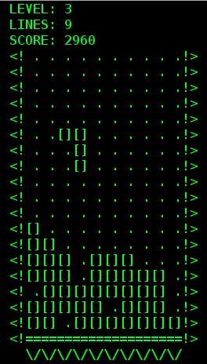
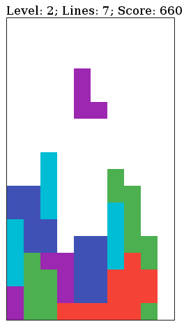
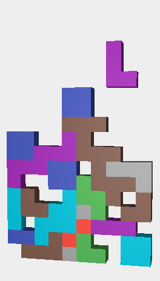

# tetr - a JavaScript library for building Tetris games

Tetr is a library that implements the model and controller part of a Tetris game. It also includes various complete examples for the view part which you can use unchanged or build off of.

## Examples

These examples can be found in the dist/examples directory.
The examples include:
* text-based (original 1984 graphics)
* DOM / React.js version
* 3D (three.js) version

## How to use

***The easiest way to get started is to start editing one of the examples that come with this project.***

If you want to start building from scratch, here's an overview by example of the data model and controller:

    // create a new game
    var game = new TetrisGame({width: 10, height: 20});
    
    // on creation there will be a new random shape at the top
    // it has a center of rotation and consists of 4 blocks
    game.currentShape
    -> {center: [5, 1], blocks: [...]}
    
    var firstBlock = game.currentShape.blocks[0]
    -> {position: [4, 0], color: '#3f51b5'}
    
    game.score
    -> 0
    
    game.level
    -> 0
    
    // advance the game by one step; the current shape moves down
    game.tick();
    game.currentShape.center
    -> [5, 2]
    // access the first block
    game.currentShape.blocks[0]
    -> {position: [4, 1], color: '#3f51b5'}
    
    // move the current shape to the right (if possible)
    game.moveCurrentShape('r');
    
    // rotate the current shape (clockwise)
    game.rotateCurrentShape();
    
    // move the current shape down
    game.moveCurrentShape('d');
    
    // advance the game by some more steps:
    game.tick();
    ...
    game.tick();
    // calling game.tick() will automatically clear full rows
    
    // by now there are some blocks at the bottom of the field
    game.existingBlocks
    -> [Block(), Block(), Block(), ...]
